<!--
  One animated SVG, rendered by `python -m gen` (see gen/) and refreshed daily
  by .github/workflows/render.yml.  Pure SVG + CSS keyframes: no JavaScript,
  no external services.  Live numbers come from the GitHub GraphQL API.
-->

  

  <a href="https://linkedin.com/in/saharshbaiju"><code>linkedin → /in/saharshbaiju</code></a> ·
  <a href="https://x.com/saharsh_baiju"><code>x → @saharsh_baiju</code></a> ·
  <a href="mailto:saharshbaiju@gmail.com"><code>mail → saharshbaiju@gmail.com</code></a>

<code>$ cat HOW_IT_WORKS</code>

- `gen/scenes/scramble.py` — a rectangle of random ASCII decodes column by column into a 5×7 bitmap name.
- `gen/scenes/globe.py` — a real 2° land mask (`gen/data/landmask.txt`) ray-cast per cell with a lit hemisphere and 23.4° axial tilt. The red `@` is Amritapuri.
- `gen/scenes/htop.py`, `gen/scenes/ps.py` — languages as CPU meters, contributions as memory, recent repos as processes, the contribution calendar as an `xxd` dump.
- `gen/scenes/blackhole.py` — an edge-on accretion disk: the near half crosses in front of the shadow, the far half is lensed over the top, Doppler beaming brightens the approaching side, hot spots flow around the ring.
- `gen/svg.py` — every scene is a list of frames; one `<g>` per frame, cycled by a CSS `steps()` keyframe. GitHub allows CSS animation inside ``-embedded SVGs, so it all runs with zero JavaScript.
- Extras not on the page (`python -m gen --extras`): donut.c torus, a rotating tesseract, an extruded 3D name, a dmesg boot log and a warrior on horseback that rides to your contribution count.
- `.github/workflows/render.yml` re-renders and commits the screen every day.

