<!--
  Rendered by `python -m gen` (see gen/) into a few borderless SVGs, refreshed
  daily by .github/workflows/render.yml. Pure SVG + CSS keyframes, no JS, no
  external services. The session panel is driven by issues (shell.yml).
-->

  <b>run a command on this profile</b> — it executes through a GitHub issue and renders above within a minute 
  <a href="https://github.com/saharshbaiju/saharshbaiju/issues/new?title=%24%20say%20hello%20from%20%3Cyour%20name%3E&body=Just%20press%20%22Submit%20new%20issue%22.%20The%20command%20in%20the%20title%20runs%20on%20the%20profile%20within%20a%20minute%2C%20then%20this%20issue%20closes%20itself%20with%20the%20output."><code>$ say hello</code></a> ·
  <a href="https://github.com/saharshbaiju/saharshbaiju/issues/new?title=%24%20cowsay%20moo&body=Just%20press%20%22Submit%20new%20issue%22.%20The%20command%20in%20the%20title%20runs%20on%20the%20profile%20within%20a%20minute%2C%20then%20this%20issue%20closes%20itself%20with%20the%20output."><code>$ cowsay moo</code></a> ·
  <a href="https://github.com/saharshbaiju/saharshbaiju/issues/new?title=%24%20fortune&body=Just%20press%20%22Submit%20new%20issue%22.%20The%20command%20in%20the%20title%20runs%20on%20the%20profile%20within%20a%20minute%2C%20then%20this%20issue%20closes%20itself%20with%20the%20output."><code>$ fortune</code></a> ·
  <a href="https://github.com/saharshbaiju/saharshbaiju/issues/new?title=%24%20neofetch&body=Just%20press%20%22Submit%20new%20issue%22.%20The%20command%20in%20the%20title%20runs%20on%20the%20profile%20within%20a%20minute%2C%20then%20this%20issue%20closes%20itself%20with%20the%20output."><code>$ neofetch</code></a> ·
  <a href="https://github.com/saharshbaiju/saharshbaiju/issues/new?title=%24%20ping&body=Just%20press%20%22Submit%20new%20issue%22.%20The%20command%20in%20the%20title%20runs%20on%20the%20profile%20within%20a%20minute%2C%20then%20this%20issue%20closes%20itself%20with%20the%20output."><code>$ ping</code></a> ·
  <a href="https://github.com/saharshbaiju/saharshbaiju/issues/new?title=%24%20help&body=Just%20press%20%22Submit%20new%20issue%22.%20The%20command%20in%20the%20title%20runs%20on%20the%20profile%20within%20a%20minute%2C%20then%20this%20issue%20closes%20itself%20with%20the%20output."><code>$ help</code></a>

  <a href="https://linkedin.com/in/saharshbaiju"><code>linkedin → /in/saharshbaiju</code></a> ·
  <a href="https://x.com/saharsh_baiju"><code>x → @saharsh_baiju</code></a> ·
  <a href="mailto:saharshbaiju@gmail.com"><code>mail → saharshbaiju@gmail.com</code></a>

<code>$ cat HOW_IT_WORKS</code>

- `gen/scenes/scramble.py` — a rectangle of random ASCII decodes column by column into shadowed block letters, plays once and holds.
- `gen/scenes/globe.py` — a real 2° land mask (`gen/data/landmask.txt`) ray-cast per cell with a lit hemisphere, 23.4° axial tilt, and a satellite on an inclined orbit that is occluded behind the planet. The red `@` is Amritapuri.
- `gen/scenes/htop.py`, `gen/scenes/ps.py` — languages as CPU meters, contributions as memory, recent repos as processes, a GitHub-style contribution calendar.
- `gen/shell.py` + `.github/workflows/shell.yml` — the interactive part. An issue titled `$ <command>` triggers a workflow that parses the title (never a real shell), appends the output to `gen/data/session.json`, re-renders, comments the output back and closes the issue.
- `gen/scenes/blackhole.py` — an edge-on accretion disk: the near half crosses in front of the shadow, the far half is lensed over the top, Doppler beaming brightens the approaching side, hot spots flow around the ring.
- `gen/svg.py` — every scene is a list of frames; one `<g>` per frame, cycled by a CSS `steps()` keyframe. GitHub allows CSS animation inside ``-embedded SVGs, so it all runs with zero JavaScript.
- Extras not on the page (`python -m gen --extras`): donut.c torus, a rotating tesseract, an extruded 3D name, a dmesg boot log and a warrior on horseback that rides to the contribution count.

